# GitHub Actions Cache 架构深度剖析

> 深度解析 GitHub Actions Cache 的代码化定义、平台层缓存方案设计与调度执行流程

---

## 目录

1. [架构概览](#1-架构概览)
2. [Cache Action 定义设计](#2-cache-action-定义设计)
3. [平台层缓存方案](#3-平台层缓存方案)
4. [缓存调度执行流程](#4-缓存调度执行流程)
5. [Key 匹配机制](#5-key-匹配机制)
6. [缓存作用域与访问控制](#6-缓存作用域与访问控制)
7. [性能优化与最佳实践](#7-性能优化与最佳实践)

---

## 1. 架构概览

### 1.1 整体架构图

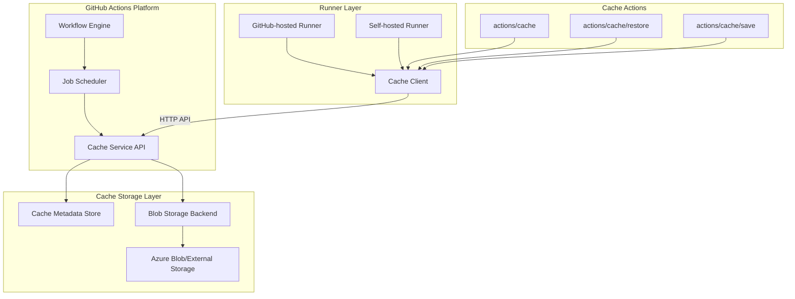

### 1.2 核心组件关系

```mermaid
flowchart TB
    subgraph User_Layer["用户层"]
        U1[workflow.yml] -->|uses| U2[cache action]
    end
    
    subgraph Action_Layer["Action 层"]
        A1[cache action.yml] --> A2[action logic]
        A2 --> A3[@actions/cache npm package]
    end
    
    subgraph Service_Layer["服务层"]
        S1[Cache Service API] --> S2[Authentication]
        S2 --> S3[Rate Limiting]
        S3 --> S4[Cache Backend]
    end
    
    U2 --> A1
    A3 -->|REST API| S1
```

---

## 2. Cache Action 定义设计

### 2.1 完整元数据定义

```yaml
# action.yml - actions/cache@v4 核心定义
name: 'Cache'
description: 'Cache artifacts like dependencies and build outputs to improve workflow execution time'
author: 'GitHub'

inputs:
  # 核心参数
  key:
    description: 'An explicit key for a cache entry'
    required: true
  
  path:
    description: 'A list of files, directories, and wildcard patterns to cache and restore'
    required: true
  
  restore-keys:
    description: >-
      An ordered multiline string listing the prefix-matched keys,
      that are used for restoring stale cache if no cache hit occurred for key.
    required: false
  
  upload-chunk-size:
    description: 'The chunk size used to split up large files during upload, in bytes'
    required: false
  
  enableCrossOsArchive:
    description: 'An optional boolean when enabled, allows windows runners to save or restore caches that can be restored or saved respectively on other platforms'
    default: 'false'
    required: false
  
  fail-on-cache-miss:
    description: 'Fail the workflow if cache entry is not found'
    default: 'false'
    required: false
  
  lookup-only:
    description: 'Do not save the cache if it does not exist'
    default: 'false'
    required: false

outputs:
  cache-hit:
    description: >-
      A boolean value to indicate an exact match was found for the key.
      Indicates if the key was an exact match: 'true' or 'false'
  
  cache-primary-key:
    description: 'The primary key used for the cache lookup'
  
  cache-matched-key:
    description: 'The matched key used for the cache lookup'

runs:
  using: 'node20'
  main: 'dist/restore/index.js'    # Restore 阶段
  post: 'dist/save/index.js'       # Save 阶段（post job hook）
  post-if: 'success()'
```

### 2.2 分离式 Cache Action 定义

```yaml
# restore/action.yml - 独立 Restore Action
name: 'Cache Restore'
description: 'Restore cached files'

inputs:
  key:
    description: 'Key for cache lookup'
    required: true
  path:
    description: 'Paths to restore'
    required: true
  restore-keys:
    description: 'Fallback keys'
    required: false

outputs:
  cache-hit:
    description: 'Exact match indicator'
  cache-primary-key:
    description: 'Primary key'
  cache-matched-key:
    description: 'Matched key'

runs:
  using: 'node20'
  main: 'dist/index.js'
  # 注意：无 post hook，不执行保存
```

```yaml
# save/action.yml - 独立 Save Action
name: 'Cache Save'
description: 'Save files to cache'

inputs:
  key:
    description: 'Key for saving cache'
    required: true
  path:
    description: 'Paths to cache'
    required: true

runs:
  using: 'node20'
  main: 'dist/index.js'
```

### 2.3 Action 类型架构

```mermaid
graph TB
    subgraph Unified_Action["统一 Action"]
        U1[actions/cache@v4]
        U1 --> U2[Restore Phase]
        U1 --> U3[Save Phase - Post Hook]
    end
    
    subgraph Split_Actions["分离 Actions"]
        S1[actions/cache/restore@v4]
        S2[actions/cache/save@v4]
        S1 -.->|output key| S2
    end
    
    subgraph Use_Cases["适用场景"]
        C1[简单场景] -->|推荐| U1
        C2[复杂条件缓存] -->|推荐| S1
        C2 -->|按需保存| S2
        C3[跨 job 缓存] -->|必须| S1
        C3 -->|必须| S2
    end
```

---

## 3. 平台层缓存方案

### 3.1 存储后端架构

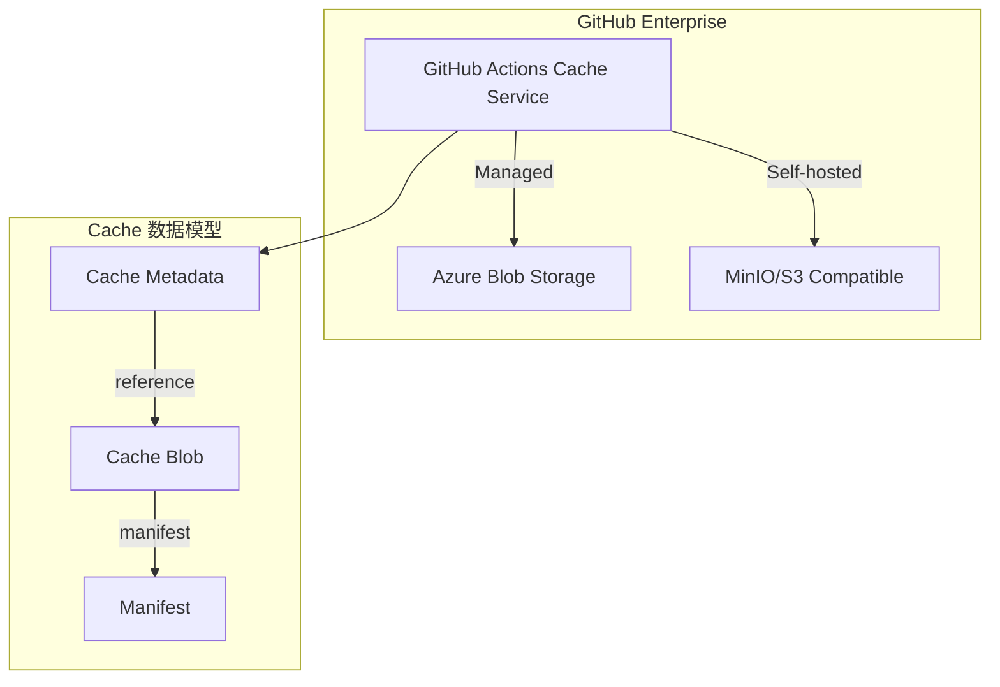

### 3.2 存储实体关系

| 实体 | 描述 | 存储位置 |
|------|------|----------|
| **Cache Entry** | 缓存元数据（key、version、scope） | 关系型数据库 |
| **Cache Archive** | 压缩后的缓存内容（tar.gz） | Blob 存储 |
| **Cache Manifest** | 文件列表和校验信息 | 随 Archive 存储 |

### 3.3 平台限制与配额

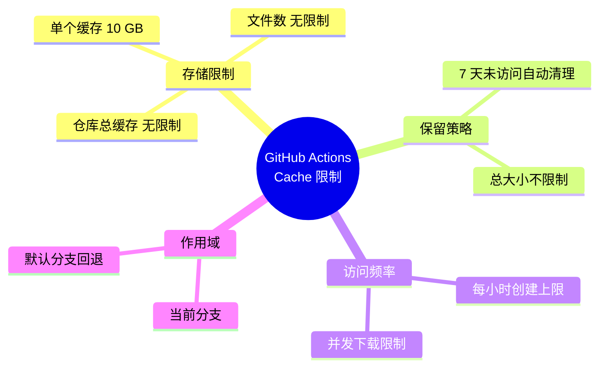

---

## 4. 缓存调度执行流程

### 4.1 完整生命周期

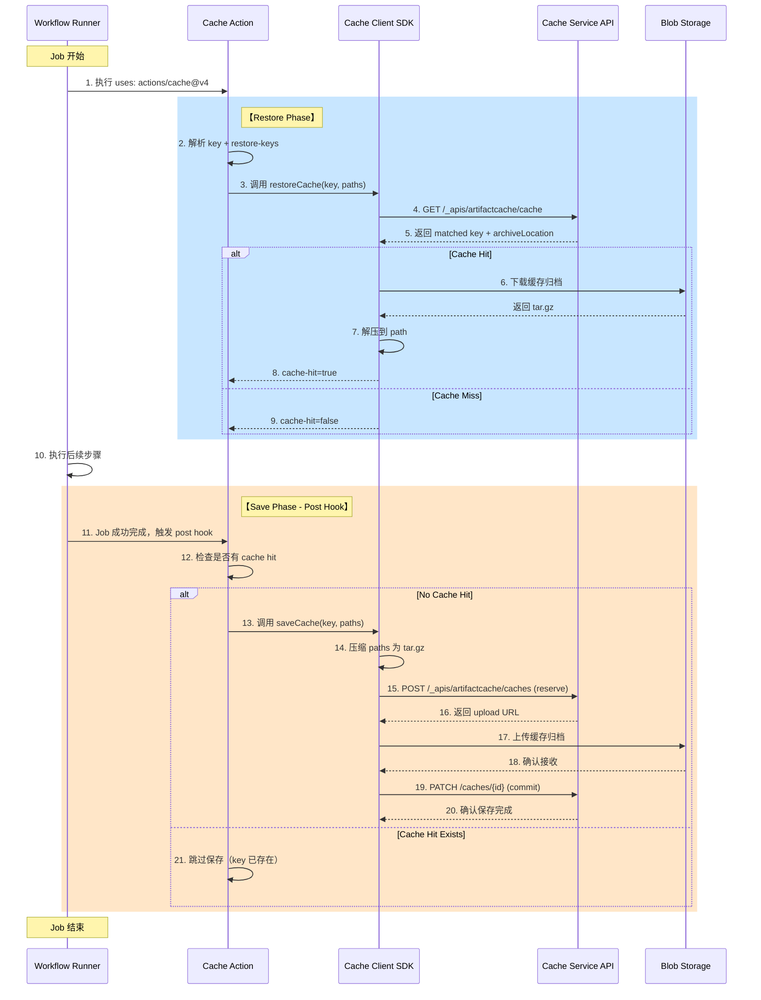

### 4.2 恢复阶段详细流程

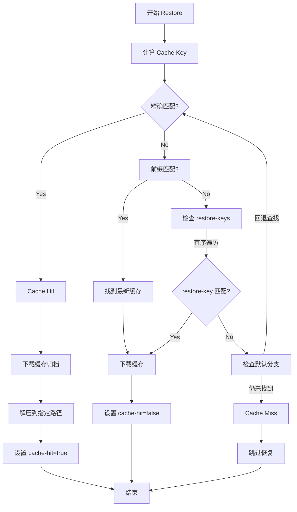

### 4.3 保存阶段详细流程

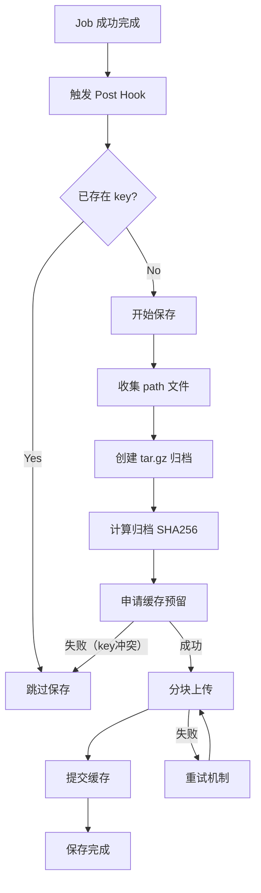

---

## 5. Key 匹配机制

### 5.1 Key 搜索优先级

```mermaid
graph TB
    subgraph Priority["搜索优先级（从高到低）"]
        P1[① 精确匹配 key + version]
        P2[② 前缀匹配 key]
        P3[③ restore-keys[0] 精确匹配]
        P4[④ restore-keys[0] 前缀匹配]
        P5[⑤ restore-keys[1...n] 遍历]
        P6[⑥ 默认分支回退查找]
    end
    
    P1 -->|未命中| P2
    P2 -->|未命中| P3
    P3 -->|未命中| P4
    P4 -->|未命中| P5
    P5 -->|未命中| P6
```

### 5.2 Cache Version 机制

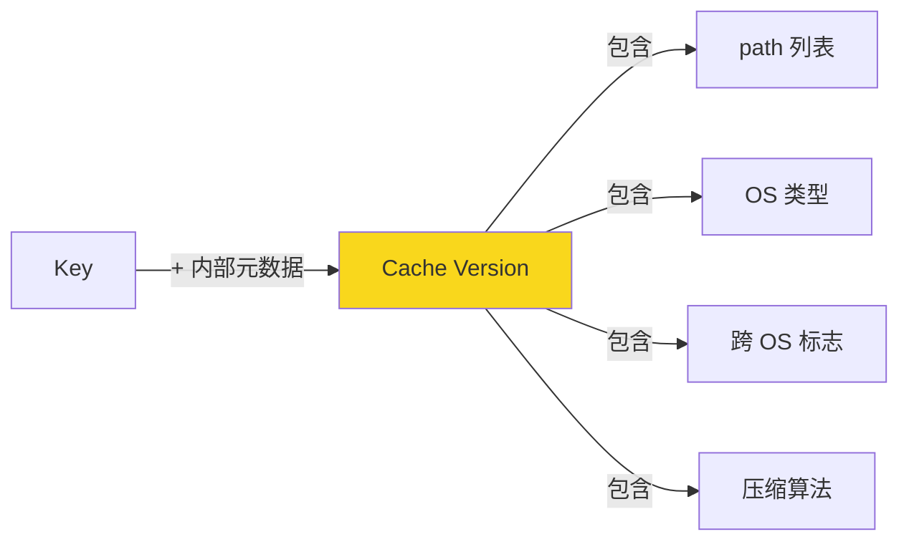

Cache Version 是 GitHub 内部计算的，用于确保：
- 相同 key 但不同 path 配置不会冲突
- 跨 OS 缓存隔离（除非开启 `enableCrossOsArchive`）
- 压缩格式兼容性

### 5.3 Key 设计策略

```yaml
# 推荐 Key 设计模式

# 模式 1: 基于 lockfile hash（依赖缓存）
- uses: actions/cache@v4
  with:
    path: ~/.npm
    key: ${{ runner.os }}-npm-${{ hashFiles('**/package-lock.json') }}
    restore-keys: |
      ${{ runner.os }}-npm-
      ${{ runner.os }}-

# 模式 2: 基于 commit SHA（构建输出缓存）
- uses: actions/cache@v4
  with:
    path: ./build
    key: ${{ runner.os }}-build-${{ github.sha }}
    restore-keys: |
      ${{ runner.os }}-build-

# 模式 3: 多维度组合（复杂项目）
- uses: actions/cache@v4
  with:
    path: |
      node_modules
      .next/cache
    key: >-
      ${{ runner.os }}-
      node-${{ matrix.node-version }}-
      ${{ hashFiles('**/package-lock.json') }}-
      ${{ hashFiles('**.[jt]s', '**.[jt]sx') }}
    restore-keys: |
      ${{ runner.os }}-node-${{ matrix.node-version }}-
      ${{ runner.os }}-node-
```

---

## 6. 缓存作用域与访问控制

### 6.1 作用域模型

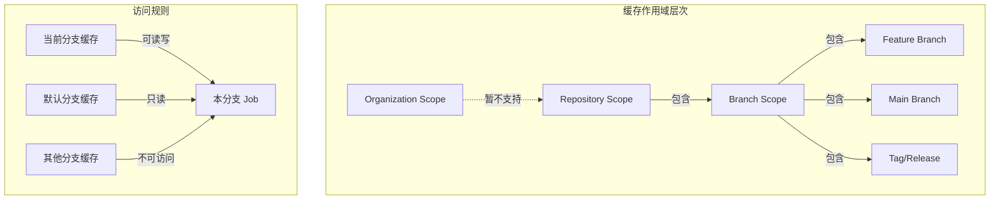

### 6.2 跨分支缓存策略

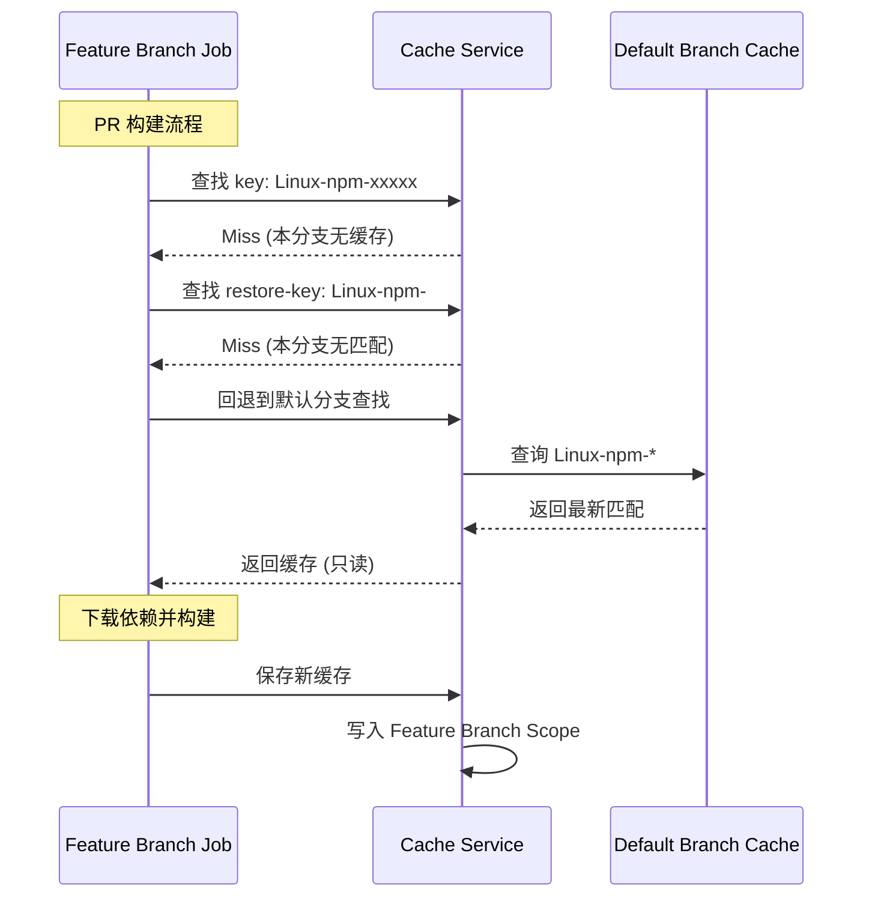

### 6.3 访问限制汇总

| 场景 | 访问权限 | 说明 |
|------|----------|------|
| 当前分支 | ✅ 读写 | 完全控制 |
| 默认分支 | ✅ 只读 | 只能 restore，不能 overwrite |
| 其他分支 | ❌ 无 | 无法访问 |
| 其他仓库 | ❌ 无 | 完全隔离 |
| Fork 仓库 | ❌ 无 | 无法访问原仓库缓存 |

---

## 7. 性能优化与最佳实践

### 7.1 缓存分层策略

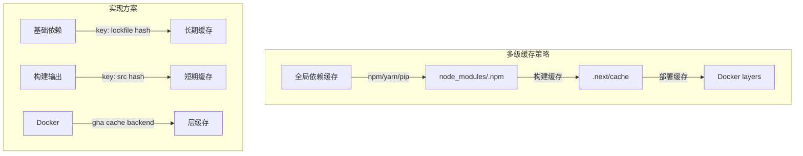

### 7.2 缓存优化配置

```yaml
# 高级缓存配置示例
name: Optimized Build

on: [push, pull_request]

jobs:
  build:
    runs-on: ubuntu-latest
    steps:
      - uses: actions/checkout@v4
      
      # Layer 1: 全局 npm 缓存
      - name: Cache npm global
        uses: actions/cache@v4
        with:
          path: ~/.npm
          key: ${{ runner.os }}-npm-global-${{ hashFiles('**/package-lock.json') }}
          restore-keys: ${{ runner.os }}-npm-global-
      
      # Layer 2: node_modules
      - name: Cache node_modules
        id: cache-modules
        uses: actions/cache@v4
        with:
          path: node_modules
          key: ${{ runner.os }}-modules-${{ hashFiles('**/package-lock.json') }}
      
      # 条件安装：仅缓存 miss 时
      - name: Install dependencies
        if: steps.cache-modules.outputs.cache-hit != 'true'
        run: npm ci
      
      # Layer 3: 构建缓存
      - name: Cache Next.js build
        uses: actions/cache@v4
        with:
          path: |
            .next/cache
            .turbo
          key: ${{ runner.os }}-nextjs-${{ hashFiles('**.[jt]s', '**.[jt]sx') }}-${{ github.sha }}
          restore-keys: |
            ${{ runner.os }}-nextjs-${{ hashFiles('**.[jt]s', '**.[jt]sx') }}-
            ${{ runner.os }}-nextjs-
      
      # 分离式保存：条件构建缓存
      - name: Restore build cache
        id: build-cache
        uses: actions/cache/restore@v4
        with:
          path: dist
          key: ${{ runner.os }}-build-${{ github.sha }}
          restore-keys: ${{ runner.os }}-build-
      
      - name: Build
        run: npm run build
      
      - name: Save build cache
        if: steps.build-cache.outputs.cache-hit != 'true'
        uses: actions/cache/save@v4
        with:
          path: dist
          key: ${{ steps.build-cache.outputs.cache-primary-key }}
```

### 7.3 性能对比

| 策略 | 构建时间 | 缓存大小 | 适用场景 |
|------|----------|----------|----------|
| 无缓存 | 100% | - | 首次运行 |
| 仅 npm 缓存 | 60% | ~50MB | Node.js 项目 |
| npm + node_modules | 30% | ~500MB | 推荐方案 |
| 全量缓存 | 10% | ~1GB+ | 大型项目 |

### 7.4 避坑指南

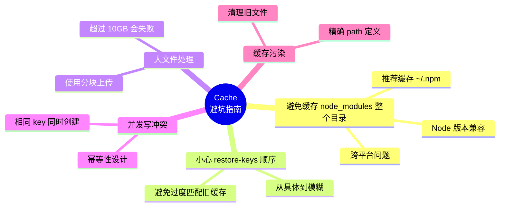

---

## 附录

### A. Cache API 端点

```yaml
# GitHub Actions Cache REST API

# 查询缓存
GET /_apis/artifactcache/cache
Params:
  - keys: string[]
  - version: string

# 预留缓存
POST /_apis/artifactcache/caches
Body:
  - key: string
  - version: string
  - cacheSize: number

# 提交缓存
PATCH /_apis/artifactcache/caches/{cacheId}
Body:
  - size: number

# 删除缓存
DELETE /_apis/artifactcache/caches/{cacheId}
```

### B. 术语表

| 术语 | 定义 |
|------|------|
| **Cache Hit** | Key 精确匹配，成功恢复缓存 |
| **Cache Miss** | 无匹配 key，需重新生成缓存 |
| **Restore Key** | 前缀匹配的回退 key |
| **Cache Version** | GitHub 内部计算的缓存元数据哈希 |
| **Post Hook** | Job 完成后自动执行的保存逻辑 |
| **GHA Cache** | GitHub Actions Cache 的简称 |

### C. 版本演进

| 版本 | 重要变更 |
|------|----------|
| v1-v2 | 已弃用（2025年停止服务） |
| v3 | 改进大文件支持（>2GB） |
| v4 | 全新后端，性能提升，支持分离式 actions |

---

*文档版本: 1.0*  
*最后更新: 2025-02-05*  
*作者: Claude Code*
