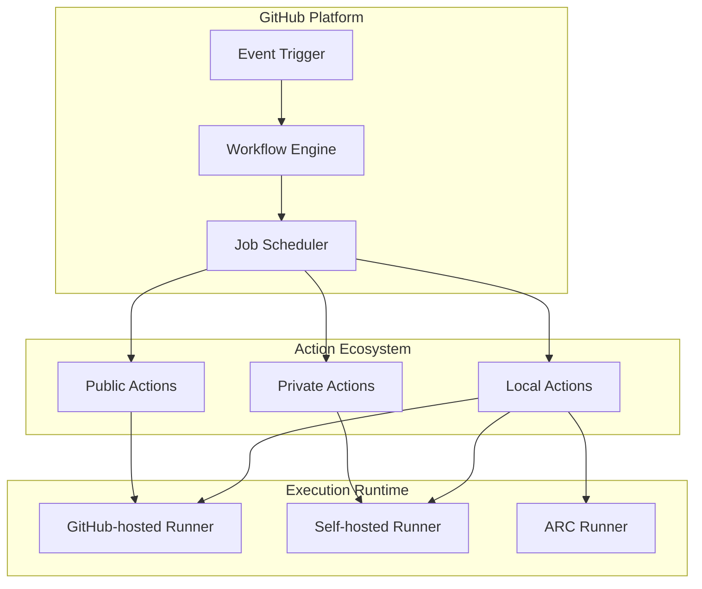
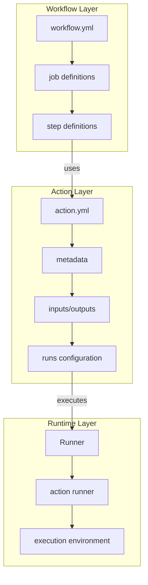
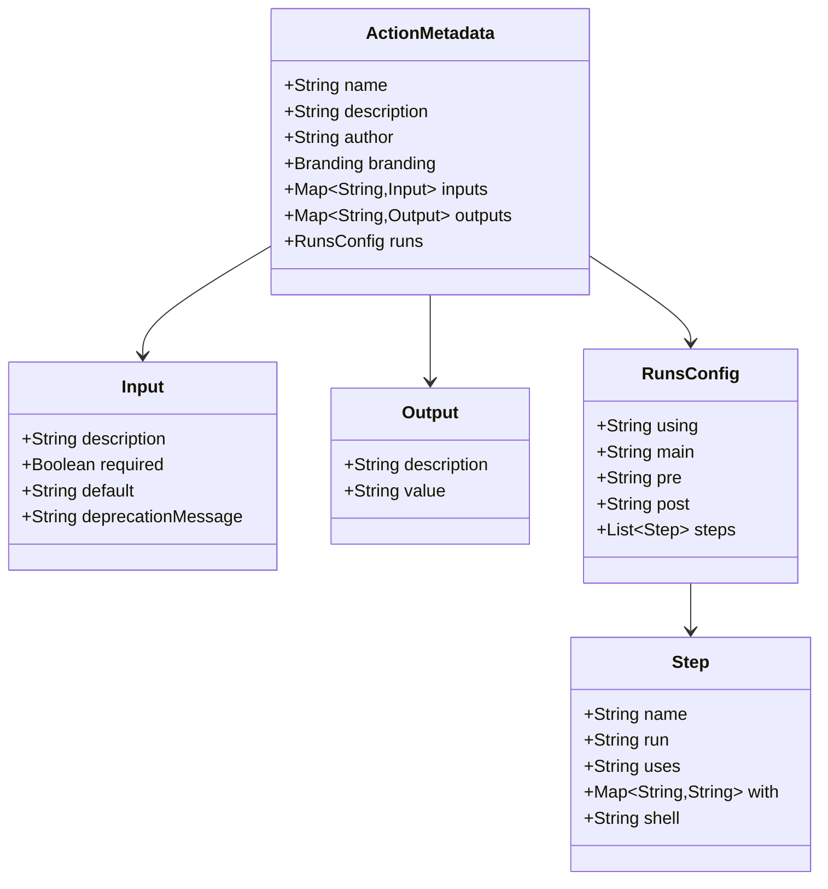
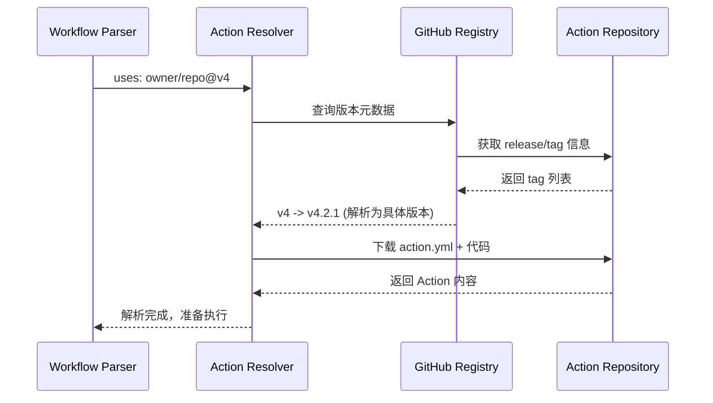
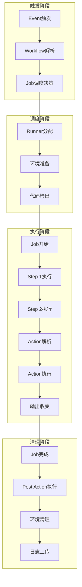
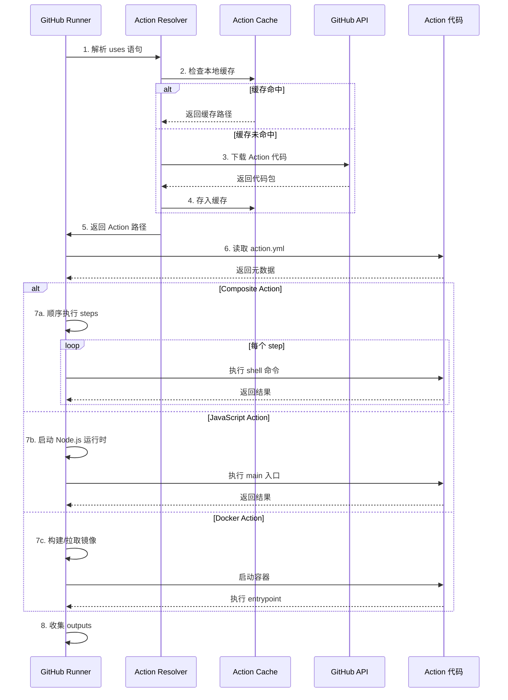
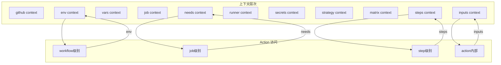
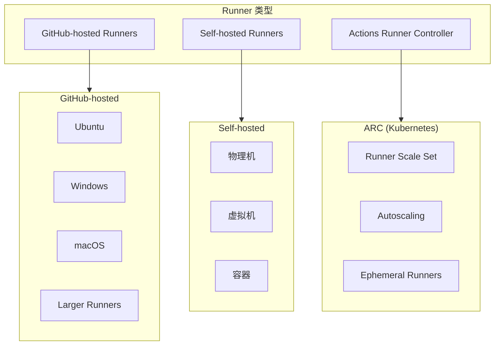
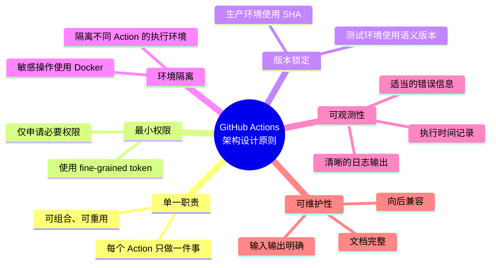

# GitHub Actions 自定义 Action 架构深度剖析

> 深度解析 GitHub Actions 自定义 Action 的代码化定义、插件引用机制与调度执行流程

---

## 目录

1. [架构概览](#1-架构概览)
2. [自定义 Action 类型体系](#2-自定义-action-类型体系)
3. [Action 元数据定义设计](#3-action-元数据定义设计)
4. [插件引用与版本控制](#4-插件引用与版本控制)
5. [调度执行流程](#5-调度执行流程)
6. [Runner 执行架构](#6-runner-执行架构)
7. [最佳实践与安全考量](#7-最佳实践与安全考量)

---

## 1. 架构概览

### 1.1 核心组件关系



### 1.2 层次架构



---

## 2. 自定义 Action 类型体系

### 2.1 三种核心类型

| 类型 | 执行环境 | 适用场景 | 平台支持 |
|------|----------|----------|----------|
| **Composite** | 调用方 Runner | 步骤组合、脚本封装 | Linux/macOS/Windows |
| **JavaScript** | Node.js 运行时 | 复杂逻辑、API 集成 | Linux/macOS/Windows |
| **Docker** | 容器环境 | 环境隔离、依赖复杂 | Linux only |

### 2.2 类型对比架构

```mermaid
graph LR
    subgraph Composite["Composite Action"]
        C1[action.yml] --> C2[steps组合]
        C2 --> C3[Shell脚本]
        C3 --> C4[其他Action调用]
    end
    
    subgraph JavaScript["JavaScript Action"]
        J1[action.yml] --> J2[Node.js运行时]
        J2 --> J3[index.js]
        J3 --> J4[@actions/toolkit]
    end
    
    subgraph Docker["Docker Action"]
        D1[action.yml] --> D2[Dockerfile]
        D2 --> D3[容器镜像]
        D3 --> D4[entrypoint.sh]
    end
    
    style Composite fill:#e3f2fd
    style JavaScript fill:#f3e5f5
    style Docker fill:#e8f5e9
```

---

## 3. Action 元数据定义设计

### 3.1 完整元数据结构

```yaml
# action.yml - 完整元数据定义示例
name: 'Action Display Name'           # 必需：显示名称
description: 'Detailed description'    # 必需：功能描述
author: 'Author Name'                  # 可选：作者信息

# 品牌标识（Marketplace 展示）
branding:
  icon: 'check-circle'                 # Feather 图标
  color: 'green'                       # 徽章颜色

# 输入参数定义
inputs:
  input-name:
    description: 'Input description'
    required: true                     # 是否必需
    default: 'default-value'           # 默认值
  optional-input:
    description: 'Optional input'
    required: false
    deprecationMessage: 'Use new-input instead'  # 弃用提示

# 输出参数定义
outputs:
  output-name:
    description: 'Output description'
    value: ${{ steps.step-id.outputs.result }}   # Composite类型

# 执行配置（三种类型三选一）
runs:
  # === Composite Action ===
  using: "composite"
  steps:
    - name: Step 1
      run: echo "Hello"
      shell: bash
    - name: Step 2
      uses: actions/checkout@v4
      with:
        repository: owner/repo
  
  # === JavaScript Action ===
  # using: "node20"
  # main: "dist/index.js"
  # pre: "dist/setup.js"           # 可选：前置执行
  # pre-if: runner.os == 'Linux'   # 前置条件
  # post: "dist/cleanup.js"        # 可选：后置清理
  # post-if: always()              # 后置执行条件
  
  # === Docker Action ===
  # using: "docker"
  # image: "Dockerfile"            # 或镜像地址
  # env:
  #   ENV_VAR: value
  # args:
  #   - "arg1"
  #   - "arg2"
  # entrypoint: "custom-entrypoint" # 可选：覆盖默认入口
  # pre-entrypoint: "pre.sh"        # 可选：前置脚本
  # post-entrypoint: "post.sh"      # 可选：后置脚本
```

### 3.2 元数据架构解析



---

## 4. 插件引用与版本控制

### 4.1 引用语法规范

```yaml
# workflow.yml 中引用 Action 的完整语法

jobs:
  build:
    steps:
      # 方式1: 语义化版本（推荐用于公共Action）
      - uses: actions/checkout@v4
      - uses: actions/setup-node@v4.0.2
      
      # 方式2: 分支引用（不推荐生产环境）
      - uses: actions/checkout@main
      - uses: owner/repo@feature-branch
      
      # 方式3: Commit SHA（最高安全性）
      - uses: actions/checkout@b4ffde65f46336ab88eb53be808477a3936bae11
      
      # 方式4: 本地路径（同仓库）
      - uses: ./.github/actions/my-action
      - uses: ./actions/another-action
      
      # 方式5: Docker Hub 镜像
      - uses: docker://alpine:latest
      - uses: docker://ghcr.io/owner/image:tag
      
      # 方式6: 完整 Git URL
      - uses: https://github.com/owner/repo.git@main
```

### 4.2 版本解析机制



### 4.3 版本策略对比

| 引用方式 | 优点 | 缺点 | 适用场景 |
|----------|------|------|----------|
| `@v4` | 自动获取更新 | 可能引入破坏性变更 | 内部可信 Action |
| `@v4.1.0` | 精确控制 | 需手动更新 | 生产环境 |
| `@abc123` | 不可变、最安全 | 可读性差 | 高安全要求 |
| `@main` | 最新功能 | 不稳定 | 开发测试 |

---

## 5. 调度执行流程

### 5.1 完整执行生命周期



### 5.2 Action 执行详细流程



### 5.3 上下文传递机制



---

## 6. Runner 执行架构

### 6.1 Runner 类型架构



### 6.2 Action 执行环境差异

| Action 类型 | GitHub-hosted | Self-hosted | ARC |
|-------------|---------------|-------------|-----|
| Composite | ✅ | ✅ | ✅ |
| JavaScript | ✅ | ✅ (需 Node.js) | ✅ |
| Docker | ✅ | ✅ (需 Docker) | ✅ |

---

## 7. 最佳实践与安全考量

### 7.1 安全引用策略

```yaml
# 推荐的安全实践

jobs:
  secure-build:
    steps:
      # ✅ 使用 Commit SHA 固定版本
      - uses: actions/checkout@b4ffde65f46336ab88eb53be808477a3936bae11  # v4.1.1
      
      # ✅ 使用精确版本号
      - uses: actions/setup-node@v4.0.2
      
      # ❌ 避免使用分支引用
      # - uses: actions/checkout@main
      
      # ✅ 本地 Action 使用相对路径
      - uses: ./.github/actions/verified-action
      
    # ✅ 最小权限原则
    permissions:
      contents: read
      packages: write
```

### 7.2 Action 开发最佳实践

```yaml
# action.yml - 最佳实践示例
name: 'Secure Build Action'
description: 'Build application with security checks'
author: 'Your Org'

branding:
  icon: 'shield'
  color: 'blue'

inputs:
  working-directory:
    description: 'Working directory for build'
    required: false
    default: '.'
  
  # 使用 kebab-case 命名
  build-args:
    description: 'Additional build arguments'
    required: false
    default: ''

outputs:
  build-status:
    description: 'Build completion status'
    value: ${{ steps.build.outputs.status }}
  artifact-path:
    description: 'Path to build artifact'
    value: ${{ steps.build.outputs.path }}

runs:
  using: "composite"
  steps:
    # 1. 输入验证
    - name: Validate inputs
      run: |
        if [ -z "${{ inputs.working-directory }}" ]; then
          echo "::error::working-directory cannot be empty"
          exit 1
        fi
      shell: bash
    
    # 2. 主逻辑
    - name: Build application
      id: build
      working-directory: ${{ inputs.working-directory }}
      run: |
        echo "::group::Build Process"
        npm ci
        npm run build ${{ inputs.build-args }}
        echo "::endgroup::"
        echo "status=success" >> $GITHUB_OUTPUT
        echo "path=./dist" >> $GITHUB_OUTPUT
      shell: bash
    
    # 3. 错误处理
    - name: Handle failure
      if: failure()
      run: |
        echo "::error::Build failed in ${{ inputs.working-directory }}"
      shell: bash
```

### 7.3 架构设计原则



---

## 附录

### A. 完整 Action 元数据 Schema

```yaml
# action.yml JSON Schema 伪代码
{
  "type": "object",
  "required": ["name", "description", "runs"],
  "properties": {
    "name": {"type": "string"},
    "description": {"type": "string"},
    "author": {"type": "string"},
    "branding": {
      "type": "object",
      "properties": {
        "icon": {"type": "string"},
        "color": {"type": "string"}
      }
    },
    "inputs": {
      "type": "object",
      "additionalProperties": {
        "type": "object",
        "properties": {
          "description": {"type": "string"},
          "required": {"type": "boolean"},
          "default": {"type": "string"},
          "deprecationMessage": {"type": "string"}
        }
      }
    },
    "outputs": {
      "type": "object",
      "additionalProperties": {
        "type": "object",
        "properties": {
          "description": {"type": "string"},
          "value": {"type": "string"}
        }
      }
    },
    "runs": {
      "oneOf": [
        {"$ref": "#/composite"},
        {"$ref": "#/javascript"},
        {"$ref": "#/docker"}
      ]
    }
  }
}
```

### B. 术语表

| 术语 | 定义 |
|------|------|
| **Workflow** | 由事件触发的自动化过程，包含一个或多个 Job |
| **Job** | 在同一 Runner 上执行的一组 Step |
| **Step** | 执行的最小单元，可以是 Shell 命令或 Action |
| **Action** | 可重用的任务单元，可在多个 Workflow 中使用 |
| **Runner** | 执行 Job 的服务器，可以是 GitHub-hosted 或 Self-hosted |
| **Event** | 触发 Workflow 的仓库活动（如 push、pull_request） |

---

*文档版本: 1.0*  
*最后更新: 2025-02-05*  
*作者: Claude Code*
