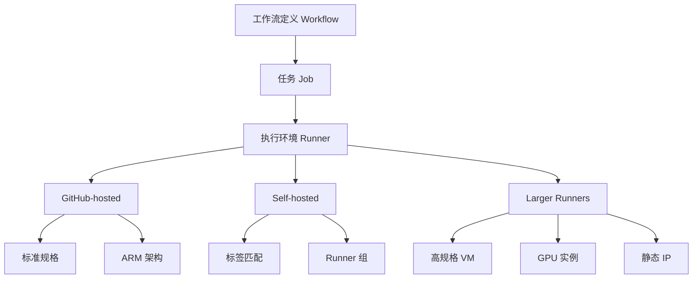
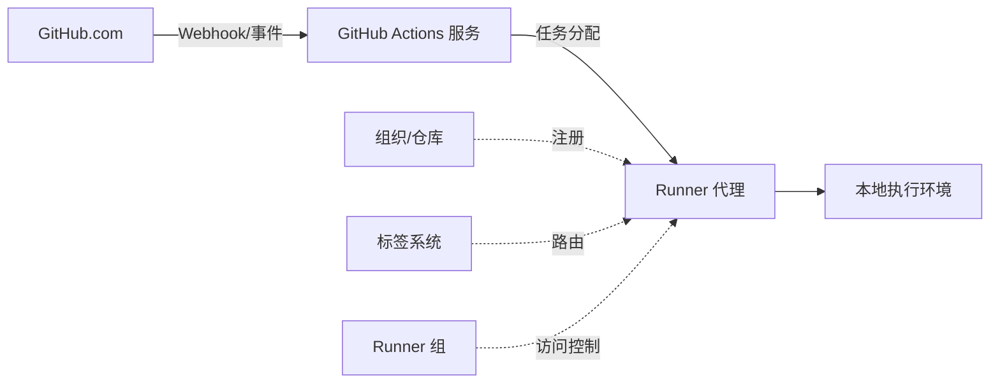
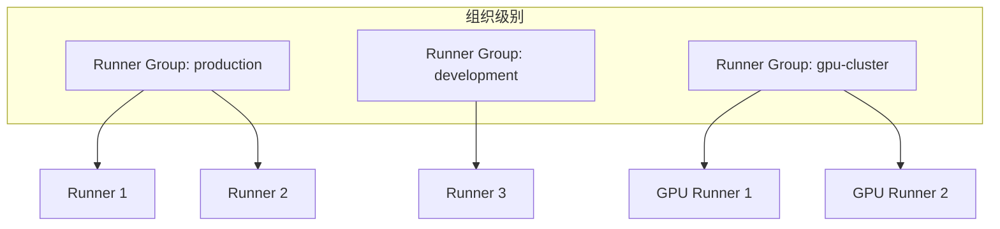
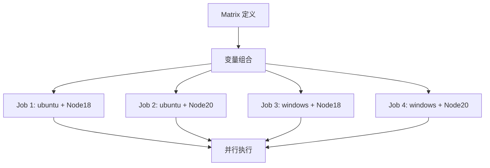
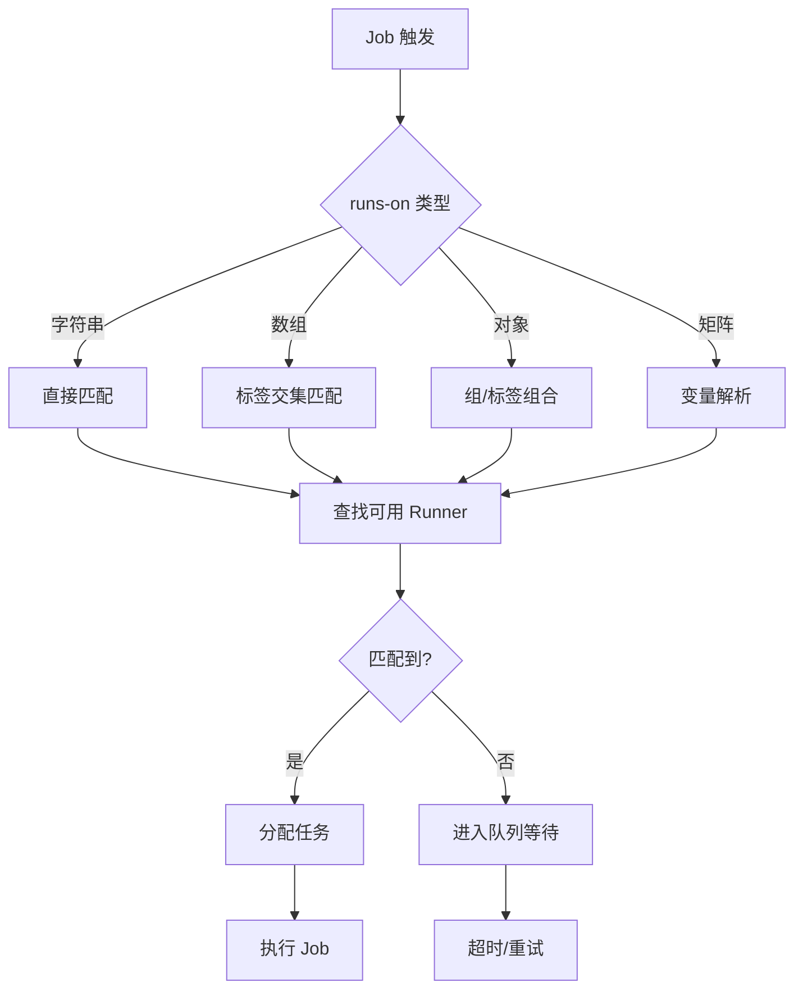
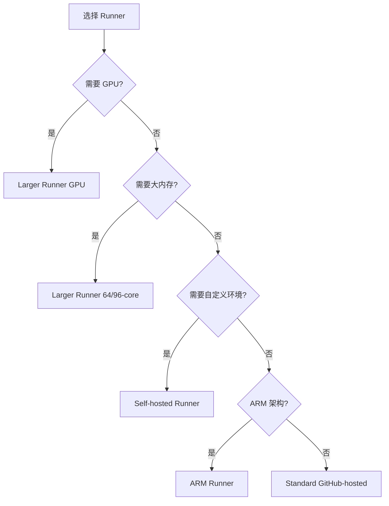

# GitHub Actions 执行资源定义架构剖析

---
aliases:
  - GitHub Actions Runner Architecture
  - GitHub Actions 执行资源
  - CI/CD 执行环境定义
tags:
  - ci-cd
  - github-actions
  - architecture
  - devops
  - infrastructure-as-code
created: 2026-02-05
updated: 2026-02-05
author: Claude Code
---

# GitHub Actions 执行资源定义架构剖析

> [!info] 文档概述
> 本文档深入剖析 GitHub Actions 中 `runs-on` 执行资源定义的代码化设计，涵盖 GitHub-hosted runners、Self-hosted runners、Larger runners 的架构设计、标签系统、矩阵策略以及最佳实践。

---

## 1. 执行资源定义概述

### 1.1 核心概念

GitHub Actions 的执行资源定义通过 `jobs.<job_id>.runs-on` 关键字在 YAML 工作流文件中声明。这是一个**声明式的基础设施即代码（IaC）**设计，允许开发者在代码中定义执行环境需求。



### 1.2 资源类型对比

| 资源类型 | 适用场景 | 管理方式 | 成本模型 | 自定义能力 |
|---------|---------|---------|---------|-----------|
| **GitHub-hosted** | 通用 CI/CD | GitHub 托管 | 按分钟计费 | 有限 |
| **Self-hosted** | 私有环境/特殊需求 | 用户托管 | 基础设施成本 | 完全自定义 |
| **Larger runners** | 高负载/大规模构建 | GitHub 托管 | 高级计费 | 中等 |

### 1.3 基础语法

```yaml
jobs:
  example_job:
    # 基础用法：单字符串
    runs-on: ubuntu-latest
    
    # 数组用法：多标签匹配
    # runs-on: [self-hosted, linux, x64, gpu]
    
    # 对象用法：组或标签
    # runs-on:
    #   group: ubuntu-runners
    #   labels: [ubuntu-20.04-16core]
    
    steps:
      - run: echo "Running on ${{ runner.os }}"
```

---

## 2. GitHub-hosted Runners 架构

### 2.1 标准 Runner 规格

> [!note] GitHub-hosted runners 是由 GitHub 完全托管的虚拟机，每次 job 运行都会创建全新的实例。

**公共仓库标准 Runner：**

| 操作系统 | YAML 标签 | CPU | 内存 | 存储 | 架构 |
|---------|----------|-----|------|------|------|
| Ubuntu Latest | `ubuntu-latest` | 4 | 16 GB | 14 GB SSD | x64/arm64 |
| Ubuntu 24.04 | `ubuntu-24.04` | 4 | 16 GB | 14 GB SSD | x64/arm64 |
| Ubuntu 22.04 | `ubuntu-22.04` | 4 | 16 GB | 14 GB SSD | x64/arm64 |
| Windows Latest | `windows-latest` | 4 | 16 GB | 14 GB SSD | x64 |
| Windows 2022 | `windows-2022` | 4 | 16 GB | 14 GB SSD | x64 |
| Windows 2019 | `windows-2019` | 4 | 16 GB | 14 GB SSD | x64 |
| macOS Latest | `macos-latest` | 3/4 | 14 GB | 14 GB SSD | x64/arm64 |
| macOS 15 | `macos-15` | 4 | 14 GB | 14 GB SSD | arm64 |
| macOS 14 | `macos-14` | 4 | 14 GB | 14 GB SSD | arm64 |
| macOS 13 | `macos-13` | 4 | 14 GB | 14 GB SSD | x64 |

**私有仓库规格差异：**
- Windows/Linux: 2 vCPU, 7 GB RAM
- macOS: 3 vCPU (M1), 7 GB RAM

### 2.2 ARM 架构支持

2024年6月，GitHub 发布了 ARM64 架构 runner，提供了更优的性价比：

```yaml
jobs:
  arm-build:
    # ARM64 Linux runner
    runs-on: ubuntu-24.04-arm
    steps:
      - uses: actions/checkout@v4
      - name: Build on ARM
        run: |
          uname -m  # 输出: aarch64
          echo "Running on ARM64 architecture"
  
  x64-build:
    # x64 对比
    runs-on: ubuntu-latest
    steps:
      - run: uname -m  # 输出: x86_64
```

> [!tip] 成本优化
> ARM64 runner 比 x64 便宜约 **37%**，适合 ARM 原生应用构建场景。

### 2.3 镜像版本策略

GitHub 使用 `-latest` 标签指向最新稳定镜像：

```yaml
jobs:
  # 使用最新稳定版本（推荐）
  build-latest:
    runs-on: ubuntu-latest
  
  # 使用特定版本（可重复构建）
  build-specific:
    runs-on: ubuntu-22.04
```

**版本演进：**
```
ubuntu-latest → ubuntu-24.04 (当前)
              → ubuntu-22.04 (之前)
              → ubuntu-20.04 (已弃用)
```

---

## 3. Self-hosted Runners 架构

### 3.1 架构设计原理

Self-hosted runner 采用**分布式代理架构**：



### 3.2 标签系统设计

标签是 Self-hosted runner 的核心路由机制：

#### 3.2.1 默认标签

注册 runner 时自动分配：

| 标签 | 说明 | 示例值 |
|-----|------|--------|
| `self-hosted` | 标识为自托管 | 始终存在 |
| `<os>` | 操作系统 | `linux`, `windows`, `macOS` |
| `<arch>` | 处理器架构 | `x64`, `ARM`, `ARM64` |

#### 3.2.2 自定义标签

创建自定义标签进行分类：

```bash
# 配置时添加标签
./config.sh --url <REPO_URL> --token <TOKEN> --labels gpu,cuda-12,high-memory

# 多标签示例
./config.sh --labels production,database-server,v2.0
```

#### 3.2.3 标签匹配规则

```yaml
jobs:
  # 必须匹配 ALL 指定标签
  gpu-job:
    runs-on: [self-hosted, linux, x64, gpu]
    # 要求 runner 同时具有这四个标签
  
  # 使用表达式动态选择
  dynamic-job:
    runs-on: [self-hosted, "${{ inputs.environment }}"]
    # 注意：表达式需要引号
```

> [!warning] 重要
> Actions Runner Controller (ARC) 不支持多标签匹配和 `self-hosted` 标签。

### 3.3 Runner 组（Runner Groups）

Runner 组提供了**组织级别的安全边界**：



#### 3.3.1 组的使用方式

```yaml
jobs:
  # 基础：使用组
  deploy-production:
    runs-on:
      group: production-runners
    steps:
      - run: echo "Deploying to production"
  
  # 高级：组 + 标签组合
  gpu-training:
    runs-on:
      group: ml-cluster
      labels: [ubuntu-latest, gpu]
    steps:
      - run: nvidia-smi
```

#### 3.3.2 访问控制矩阵

| 层级 | 可见性 | 配置权限 |
|-----|--------|---------|
| 企业级 | 整个企业 | 企业管理员 |
| 组织级 | 组织内仓库 | 组织所有者 |
| 仓库级 | 特定仓库 | 仓库管理员 |

---

## 4. Larger Runners 架构

### 4.1 设计动机

Larger runners 解决标准 runner 的**资源瓶颈**问题：

- 大内存应用编译
- 多核并行测试
- 大型容器镜像构建
- GPU 加速计算

### 4.2 规格矩阵

#### 4.2.1 Ubuntu/Windows Larger Runners

| vCPU | 内存 | 存储 | 架构 | 适用场景 |
|------|------|------|------|---------|
| 2 | 8 GB | 75 GB | x64, arm64 | 轻量级任务 |
| 4 | 16 GB | 150 GB | x64, arm64 | 标准构建 |
| 8 | 32 GB | 300 GB | x64, arm64 | 并行测试 |
| 16 | 64 GB | 600 GB | x64, arm64 | 大型应用 |
| 32 | 128 GB | 1200 GB | x64, arm64 | 企业级 |
| 64 | 208 GB | 2040 GB | arm64 | ARM 高性能 |
| 64 | 256 GB | 2040 GB | x64 | 内存密集型 |
| 96 | 384 GB | 2040 GB | x64 | 极限性能 |

#### 4.2.2 macOS Larger Runners

| vCPU | 内存 | 存储 | 架构 | 型号 |
|------|------|------|------|------|
| 5 | 14 GB | 14 GB | arm64 (M2) | M2 基础版 |
| 12 | 30 GB | 14 GB | x64 (Intel) | Intel 高性能 |

#### 4.2.3 GPU Runners

| vCPU | GPU | GPU 卡 | 内存 | GPU 显存 | 存储 |
|------|-----|--------|------|---------|------|
| 4 | 1 | Tesla T4 | 28 GB | 16 GB | 176 GB |

### 4.3 高级特性

```yaml
jobs:
  ml-training:
    # GPU runner
    runs-on: ubuntu-latest-4-cores-gpu
    steps:
      - uses: actions/checkout@v4
      - name: Setup CUDA
        run: |
          nvidia-smi
          python train.py --gpu
  
  high-memory-build:
    # 64-core 256GB 内存
    runs-on: ubuntu-latest-64-cores
    steps:
      - name: Build large project
        run: |
          make -j64  # 使用 64 线程并行编译
```

---

## 5. 矩阵策略（Matrix Strategy）

### 5.1 架构设计

矩阵策略实现了**声明式并行执行**：



### 5.2 基础语法

```yaml
jobs:
  test:
    strategy:
      matrix:
        os: [ubuntu-latest, windows-latest, macos-latest]
        node: [18, 20, 22]
        # 生成 3 × 3 = 9 个并行 job
    runs-on: ${{ matrix.os }}
    steps:
      - uses: actions/setup-node@v4
        with:
          node-version: ${{ matrix.node }}
      - run: npm test
```

### 5.3 高级矩阵操作

#### 5.3.1 Include - 添加特定组合

```yaml
jobs:
  build:
    strategy:
      matrix:
        os: [ubuntu-latest, windows-latest]
        node: [18, 20]
        include:
          # 添加额外组合
          - os: macos-latest
            node: 20
          # 添加带额外变量的组合
          - os: ubuntu-latest
            node: 22
            experimental: true
            flags: "--features=beta"
    runs-on: ${{ matrix.os }}
    steps:
      - run: |
          echo "Experimental: ${{ matrix.experimental }}"
          echo "Flags: ${{ matrix.flags }}"
```

#### 5.3.2 Exclude - 排除特定组合

```yaml
jobs:
  test:
    strategy:
      matrix:
        os: [ubuntu-latest, windows-latest, macos-latest]
        node: [16, 18, 20, 22]
        exclude:
          # Node 16 在 macOS 上已弃用
          - os: macos-latest
            node: 16
          # Windows 上跳过 Node 22（已知问题）
          - os: windows-latest
            node: 22
    runs-on: ${{ matrix.os }}
```

#### 5.3.3 动态矩阵

```yaml
jobs:
  setup:
    runs-on: ubuntu-latest
    outputs:
      matrix: ${{ steps.set-matrix.outputs.matrix }}
    steps:
      - id: set-matrix
        run: |
          if [[ "${{ github.ref }}" == "refs/heads/main" ]]; then
            MATRIX='{"service":["api","web","worker"],"node":[20]}'
          else
            MATRIX='{"service":["api"],"node":[20]}'
          fi
          echo "matrix=$MATRIX" >> $GITHUB_OUTPUT
  
  test:
    needs: setup
    strategy:
      matrix: ${{ fromJson(needs.setup.outputs.matrix) }}
    runs-on: ubuntu-latest
    steps:
      - run: echo "Testing ${{ matrix.service }}"
```

### 5.4 矩阵控制策略

```yaml
jobs:
  test:
    strategy:
      fail-fast: false      # 不因单个失败停止所有
      max-parallel: 4       # 最大并发数
      matrix:
        os: [ubuntu-latest, windows-latest, macos-latest]
        node: [18, 20, 22]
    runs-on: ${{ matrix.os }}
    continue-on-error: ${{ matrix.node == '22' }}  # Node 22 失败不标记整个 workflow 失败
```

---

## 6. 执行资源路由机制

### 6.1 路由决策流程



### 6.2 优先级与队列

```yaml
# 优先级由以下因素决定：
# 1. Runner 类型：GitHub-hosted > Self-hosted
# 2. 标签匹配度：精确匹配 > 部分匹配
# 3. 队列等待时间：FIFO
# 4. 并发限制：max-parallel

jobs:
  high-priority:
    runs-on: ubuntu-latest  # 高优先级，GitHub 托管
    
  specific-requirement:
    runs-on: [self-hosted, gpu, production]  # 需等待特定 runner
```

---

## 7. 代码化定义设计原则

### 7.1 声明式 vs 命令式

GitHub Actions 采用**声明式**设计：

| 声明式（GitHub Actions） | 命令式（传统脚本） |
|----------------------|------------------|
| `runs-on: ubuntu-latest` | `provision_vm(os="ubuntu")` |
| `runs-on: [self-hosted, gpu]` | `select_runner(labels=["gpu"])` |
| 自动资源分配 | 手动资源管理 |
| 平台抽象 | 平台依赖 |

### 7.2 可组合性设计

```yaml
# 基础定义
.base-runner: &base
  runs-on: ubuntu-latest

.gpu-runner: &gpu
  runs-on: [self-hosted, gpu]

# 组合使用
jobs:
  build:
    <<: *base
    steps:
      - run: npm build
  
  train:
    <<: *gpu
    steps:
      - run: python train.py
```

### 7.3 环境抽象层

```yaml
# 开发环境
dev-runner:
  runs-on: [self-hosted, development, linux]

# 生产环境  
prod-runner:
  runs-on: [self-hosted, production, linux]

# 通过标签实现环境隔离，而非硬编码配置
```

---

## 8. 最佳实践与模式

### 8.1 标签命名规范

```yaml
# 推荐格式：环境-用途-架构-特性
runs-on: [self-hosted, prod, build, x64, gpu]

# 避免模糊标签
# ❌ bad: [fast, big, new]
# ✅ good: [high-cpu, 32gb-ram, ubuntu-22.04]
```

### 8.2 Runner 选择决策树



### 8.3 安全最佳实践

```yaml
jobs:
  # 使用 runner 组隔离敏感任务
  deploy:
    runs-on:
      group: production-runners
      labels: [deployer]
    environment: production  # 配合环境保护规则
    steps:
      - uses: actions/checkout@v4
      - run: ./deploy.sh
```

### 8.4 性能优化模式

```yaml
# 1. 矩阵分片（Sharding）
test:
  strategy:
    matrix:
      shard: [1, 2, 3, 4]
  runs-on: ubuntu-latest
  steps:
    - run: npm test -- --shard=${{ matrix.shard }}/4

# 2. 条件 runner 选择
build:
  runs-on: ${{ github.event_name == 'push' && 'ubuntu-latest-16-cores' || 'ubuntu-latest' }}
  
# 3. 缓存优化
optimize:
  runs-on: ubuntu-latest
  steps:
    - uses: actions/cache@v4
      with:
        path: ~/.npm
        key: ${{ runner.os }}-node-${{ hashFiles('**/package-lock.json') }}
```

---

## 9. 实际应用案例

### 9.1 多架构容器构建

```yaml
name: Multi-Arch Build

on: [push]

jobs:
  build:
    strategy:
      matrix:
        include:
          - platform: linux/amd64
            runner: ubuntu-latest
          - platform: linux/arm64
            runner: ubuntu-latest-arm
    runs-on: ${{ matrix.runner }}
    steps:
      - uses: actions/checkout@v4
      - name: Set up QEMU
        uses: docker/setup-qemu-action@v3
      - name: Build
        run: |
          docker build --platform ${{ matrix.platform }} -t app:${{ matrix.platform }} .
```

### 9.2 机器学习训练管道

```yaml
name: ML Training

jobs:
  preprocess:
    runs-on: ubuntu-latest-16-cores
    steps:
      - run: python preprocess.py --workers=16
  
  train:
    needs: preprocess
    runs-on: ubuntu-latest-4-cores-gpu
    timeout-minutes: 360
    steps:
      - run: |
          nvidia-smi
          python train.py --epochs=100 --batch-size=64
  
  evaluate:
    needs: train
    runs-on: ubuntu-latest
    steps:
      - run: python evaluate.py
```

### 9.3 企业级部署

```yaml
name: Enterprise Deploy

jobs:
  build:
    runs-on: [self-hosted, build, x64]
    steps:
      - uses: actions/checkout@v4
      - run: make build
  
  test:
    needs: build
    strategy:
      matrix:
        env: [staging, preprod]
    runs-on: [self-hosted, ${{ matrix.env }}, testing]
    steps:
      - run: make test
  
  deploy:
    needs: test
    runs-on:
      group: production-deployers
    environment: production
    steps:
      - run: make deploy
```

---

## 10. 架构演进趋势

### 10.1 当前状态（2025）

- **ARM 支持**：全面支持 ARM64 架构
- **更大规格**：最高 96 vCPU / 384 GB 内存
- **GPU 集成**：Tesla T4 GPU runners
- **自托管增强**：Runner 组、静态 IP

### 10.2 未来展望

| 方向 | 可能特性 |
|-----|---------|
| 异构计算 | 更多 GPU 类型（A100, H100） |
| 边缘部署 | 边缘 runner 支持 |
| 无服务器 | Serverless runner 按需启动 |
| 智能路由 | ML 驱动的 runner 选择 |

---

## 11. 总结

GitHub Actions 的 `runs-on` 执行资源定义展现了**声明式基础设施即代码**的强大能力：

1. **灵活性**：支持字符串、数组、对象多种语法
2. **可扩展性**：GitHub-hosted 到 Self-hosted 的无缝切换
3. **并行性**：矩阵策略实现高效并行测试
4. **安全性**：Runner 组提供组织级安全边界
5. **性能**：Larger runners 满足高性能计算需求

通过合理的标签设计、矩阵策略和 runner 选择，可以构建高效、可靠、可维护的 CI/CD 管道。

---

> [!tip] 参考资源
> - [GitHub Actions 官方文档](https://docs.github.com/actions)
> - [Choosing the runner for a job](https://docs.github.com/actions/using-jobs/choosing-the-runner-for-a-job)
> - [Using self-hosted runners](https://docs.github.com/actions/hosting-your-own-runners)
> - [Larger runners 参考](https://docs.github.com/actions/reference/runners/larger-runners)

---

*文档生成时间: 2026-02-05*
*作者: Claude Code*
*版本: 1.0*
